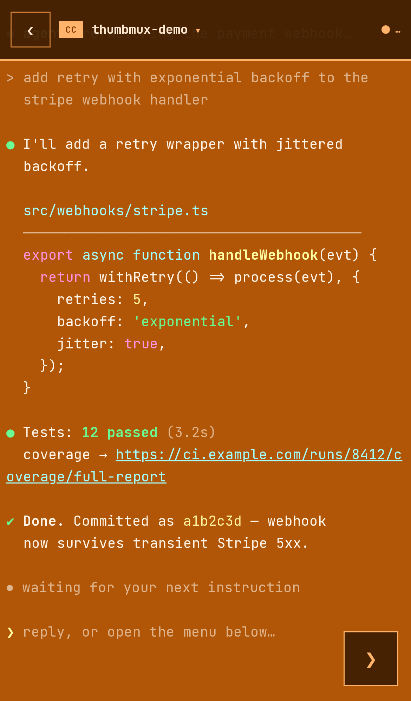
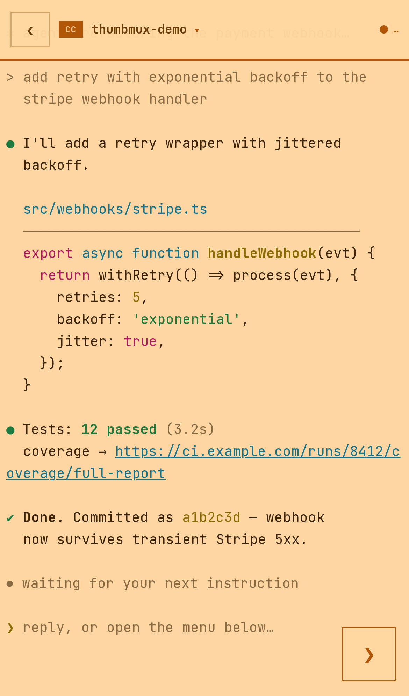

# thumbmux

**tmux for thumbs.** A mobile-first web terminal stack for driving tmux
sessions — especially AI coding agents — from your phone.

  

> **Status:** 0.x, source-first, extracted from a production system where it
> drives real Claude Code / Codex / Grok sessions daily. **Not on npm yet** —
> a runnable demo is the next roadmap item. Watch releases to catch it.

Born from a real itch: [Claude Code], Codex CLI and Grok CLI running in tmux on
a server, and a human on a phone who still has to steer them. Every web
terminal we tried treats the phone as a tiny desktop — pinch, squint, mis-tap,
rage. thumbmux treats the phone as the primary device: one-thumb controls,
native scroll physics, and a keyboard that never fights the layout.


**Why not ttyd / GoTTY / an xterm.js wrapper?** Those are excellent — and
desktop-shaped. They hand your phone a terminal *emulator* that repaints on
every scroll frame, plus an overlay keyboard bolted on top. thumbmux renders
captured pane lines as plain DOM and scrolls them with compositor transforms,
so a flick feels like a native app; input, layout and theming were designed
thumb-first instead of ported from the desktop.

## The tour

### Scrolls like an app, not a canvas

<p align="center"></p>

The viewer never runs a terminal emulator in the scroll path. Captured pane
lines render into a virtualized DOM window, and a flick is a `translate3d`
update — no reparse, no repaint of terminal cells — so scrolling runs at
whatever refresh rate your display has. You get **real text selection** (it's
a DOM), momentum and rubber-band physics tuned to feel like iOS — and older
scrollback streams in as you pull down.

**URLs are tappable** — including URLs that wrap across lines mid-output.
In the shot above, the coverage link spans two pane lines; both fragments are
live, underlined, and open the same URL. Links are reconstructed at the
current pane width, so this survives resizes too.

### Everything behind one thumb

<p align="center"></p>

A single ❯ launcher fans out the whole control surface: **one-tap preset
sends** (`continue` / `ship it` / `explain` — configurable), an **arrow pad**
for TUI menus, typing, file upload, theming — and whatever your host app adds.

The `Session settings` entry in this shot isn't part of thumbmux: the host
application injected it (agent roles, team links, auto-continue — from the
system this stack was extracted from). Actions and sheets are plugin points,
not hardcoded chrome.

### A composer that never covers the terminal

<p align="center"></p>

Opening the input sheet doesn't overlay the pane — the terminal viewport
**docks above it**, so the agent's last lines stay visible while you type.
When the OS keyboard rises, everything rides on top of that too
(VisualViewport-tracked).

The part you can't see: none of this ever resizes the underlying tmux pane.
Insets are computed against each host element's closed-state baseline so the
math cancels exactly — other viewers of the same session never see a reflow.

### Attach files from your phone

<p align="center"></p>

Pick photos, logs, anything — they upload into the session's workspace, and
the composer is **prefilled with the stored paths** (`Uploaded
"design-mock.png" → uploads/design-mock.png`), so one SEND hands them straight
to the agent.

This flow is host wiring on top of two thumbmux primitives — an `ActionFab`
action and the composer's bindable `text` — shown here as implemented in the
system this stack came from. Point it at your own upload endpoint in a few
lines.

### DIRECT mode: the keyboard *is* the terminal

<p align="center"></p>

Switch to DIRECT and the visible input box disappears — an invisible ghost
input holds focus, the OS keyboard rises, and **every keystroke streams
straight into tmux**: text (IME-composed scripts like Thai included) via input
events, Enter/Esc/Tab/arrows via keydown. It feels like typing *in* the
terminal, because effectively you are.

### Re-theme the whole surface from one color

<p align="center"></p>

Pick a swatch — or any hex. Text color, HUD chrome, borders and accent are all
derived from the background's luminance, and the ANSI text palette swaps to
contrast-picked variants for light vs dark backgrounds. No unreadable
terminals, whatever color you land on.

### Light and dark, per agent

<p align="center"></p>

Each agent type carries its own identity surface in both modes (the home
system paints Claude Code orange, Codex blue, Grok black). Your host supplies
the palette; thumbmux keeps it readable everywhere.

## What's inside

```
thumbmux/
├── core/    framework-free TypeScript, zero dependencies
├── svelte/  Svelte 5 components (everything in the tour)
└── server/  Bun/Node WebSocket mux engine for tmux
```

| package | what you get |
|---|---|
| **`@thumbmux/core`** | `ansi-html` incremental SGR→HTML renderer · `terminal-link` wrapped-URL detection · `terminal-scroll` jump-free capture merging · `prompt-scan` extraction of *submitted* prompts from raw pane text (the composer's ghost/placeholder text is filtered by its SGR-2 faint styling) · `surface` one-color→full-surface derivation · `protocol` the WS message types |
| **`@thumbmux/svelte`** | `TermView` the compositor-scroll viewer · `ComposerDock` COMPOSE/DIRECT input sheet with dock/keyboard insets · `TermHud` pinned status bar with a host panel slot · `ActionFab` launcher + action slots · `DpadSheet`, `ThemeSheet`, `NewTerminalSheet` · `ws-mux` reconnecting multiplexed WS client |
| **`@thumbmux/server`** | `TmuxWsMux` — one process serves every viewer: shared adaptive polling (4 FPS idle → 10 FPS after keystrokes), `pipe-pane` dirty signals, content-hash dedupe, scrollback history expansion, session-list pushes. Everything host-specific is injected. |

### What the server wiring looks like

```ts
import { TmuxWsMux } from '@thumbmux/server';

const mux = new TmuxWsMux({
  driver,                     // how to talk to tmux: capture/keys/resize/activity
                              // (bring your own today — a reference driver ships
                              //  with the upcoming demo)
  pipes,                      // optional: pipe-pane manager for instant dirty signals
  archive,                    // optional: scrollback archive for history expansion
  profile: (session) => ({    // per-session behavior
    resize: true,             //   browser-authoritative geometry?
    currentPaneOnly: false,   //   alt-screen TUI (capture screen, not scrollback)?
    archive: true,
  }),
  hooks: {                    // your policy layer
    onResizeRequest: (session, ws, geo, client) => ({ apply: true }),
  },
});

// in your WS handler — handleMessage also answers client keepalive pings:
ws.onmessage = (e) => mux.handleMessage(JSON.parse(e.data), ws);
ws.onclose  = () => mux.unsubscribeAll(ws);
```

### What the client wiring looks like

```svelte
<script>
  import { TermView, ComposerDock, tmuxMux } from '@thumbmux/svelte';
  const palette = {  // ANSI 0-15 + defaults — or derive one via @thumbmux/core
    base: ['#000','#f66','#6f6','#ff6','#66f','#f6f','#6ff','#eee',
           '#888','#f88','#8f8','#ff8','#88f','#f8f','#8ff','#fff'],
    defaultFg: '#e6e6e6', defaultBg: '#101014',
  };
  let composer = $state();  // openDock() must run inside the tap's call stack
  let dockFull = $state(0), kbInset = $state(0);
</script>

<!-- this viewport's closed-state bottom is 0, so it docks by the FULL sheet
     height (dockFull); hosts whose baseline is env(safe-area-inset-bottom)
     use dockInset instead — see ComposerDock's header comment -->
<div class="viewport" style:bottom={`${dockFull + kbInset}px`}>
  <TermView session="my-session" {palette} bottomInsetPx={dockFull + kbInset} />
</div>

<button class="type" onclick={() => composer?.openDock()}>⌨</button>

<ComposerDock
  bind:this={composer}
  bind:dockFull bind:kbInset
  onSend={(text) => tmuxMux.sendKeys('my-session', text + '\r')}
  onDirectText={(d) => tmuxMux.sendKeys('my-session', d)}
  onDirectKey={(seq) => tmuxMux.sendKeys('my-session', seq)}
/>

<style>
  .viewport { position: absolute; top: 0; left: 0; right: 0; }
  .type { position: absolute; right: 12px; bottom: 12px; }
</style>
```

## iOS scar tissue

The lessons are encoded in the components so you don't have to relearn them:

- iOS raises the keyboard **only** for `focus()` calls made synchronously inside
  the tap's call stack. A `setTimeout` focus silently sets `activeElement` with
  the keyboard down. (That's why `ComposerDock.openDock()` exists.)
- Safari will not scroll-to-reveal an invisible focused input — track
  `visualViewport` yourself, subtract `offsetTop`, and guard against pinch-zoom.
- An `opacity: 0` input is focusable; `display: none` is not. Keep it at
  `font-size: 16px`, or Safari zooms the page.
- Never resize the pty because a transient overlay appeared. Compute insets
  against each host element's closed-state baseline so the add-back cancels
  exactly and the pane geometry never flaps.
- The iOS keyboard is translucent — anything parked behind it shows through.

## Roadmap

- [ ] Runnable demo app + reference `TmuxDriver` (clone → `bun run demo` → scan QR)
- [ ] npm packages (`@thumbmux/core` / `svelte` / `server`)
- [ ] Scroll-feel GIF captured from a real device
- [ ] Protocol doc + conformance tests for third-party servers

The screenshots above are the production UI this stack was extracted from,
talking to a live tmux session — running a scripted demo transcript, so no
real project content leaks into the docs.

## License

MIT © [kemkem23](https://github.com/kemkem23)

[Claude Code]: https://claude.com/claude-code
