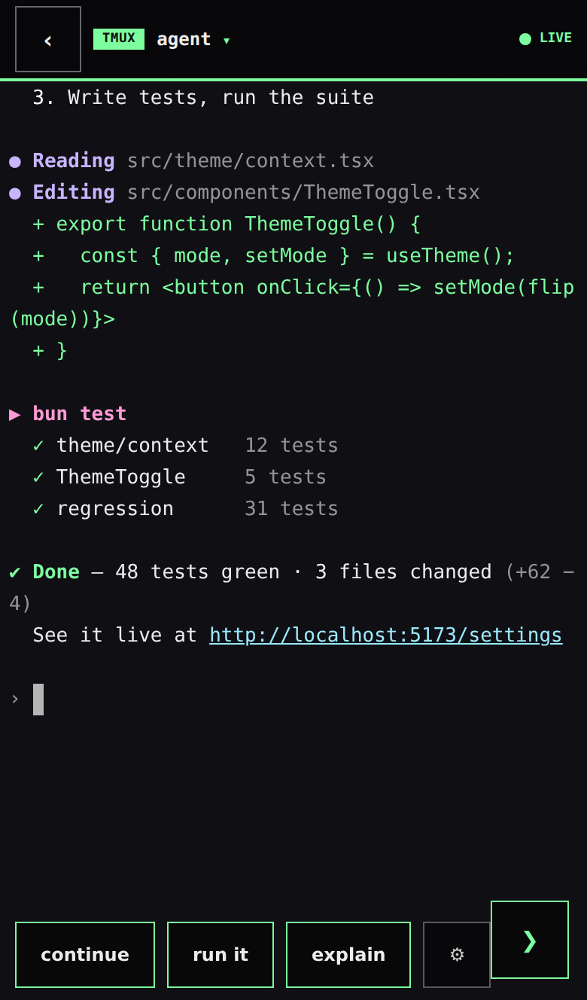
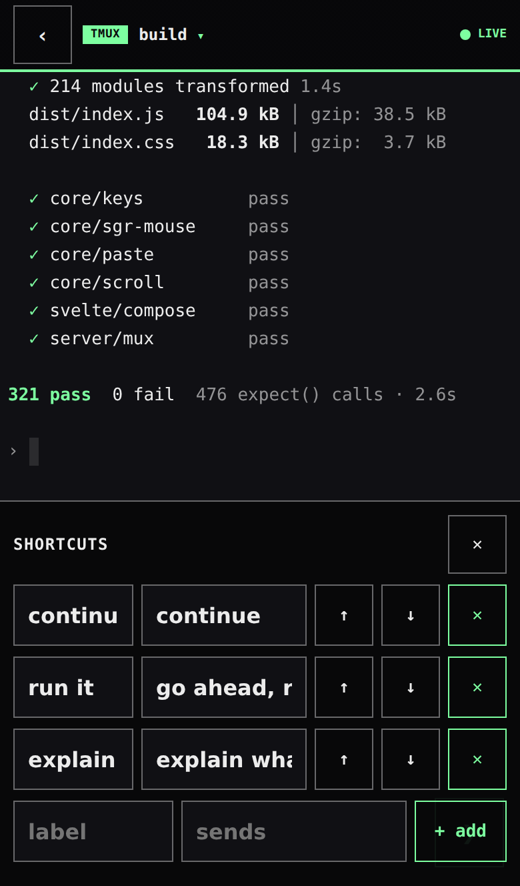
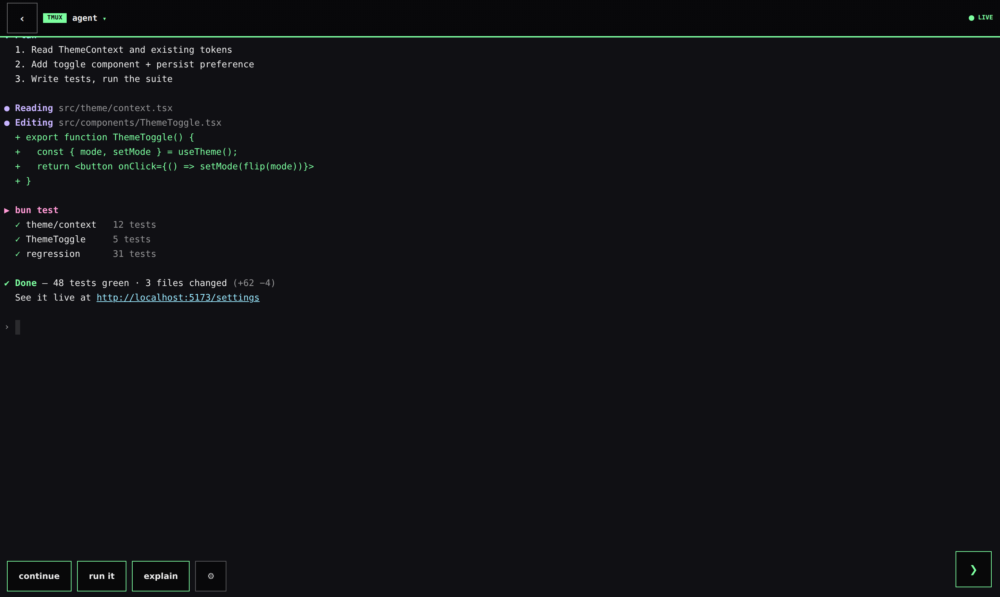
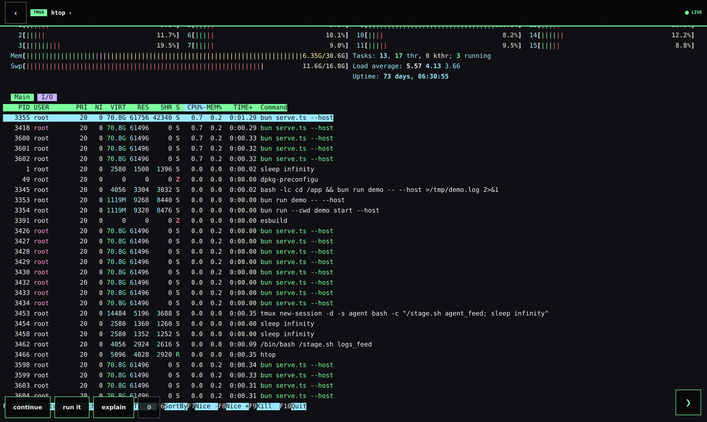

<div align="center">

# thumbmux

**tmux for thumbs — and now for desks.**

A batteries-included web terminal stack for driving tmux sessions — especially
AI coding agents — from any screen: a compositor-scroll viewer that runs at
your display's refresh rate, a keyboard-aware composer, a live session hub,
and a multiplexed WebSocket engine. Three small packages you can wire into
any app in an afternoon.

[](https://github.com/kemkem23/thumbmux/actions/workflows/ci.yml)
[](https://github.com/kemkem23/thumbmux/tags)
[](LICENSE)


<sub>Every screenshot in this README is the bundled demo running scripted
transcripts in a clean container — reproduce them yourself with `bun run demo`.</sub>

</div>

---

## Why thumbmux

Born from a real itch: agent TUIs running in tmux on a server, and a human on
a phone who still has to steer them. Every web terminal we tried treats the
phone as a tiny desktop — pinch, squint, mis-tap, rage. thumbmux treats the
phone as the primary device, and rebuilds the viewer around one idea:
**during a gesture, the compositor should be the only thing working.**

- **Scrolls at your display's refresh rate.** ANSI is parsed *off* the gesture
  path into cached HTML; the scroll itself is `translate3d` over a virtualized
  window of rows. While your finger is down, nothing parses, nothing reflows,
  nothing repaints terminal cells — 60 Hz screens get 60, 120 Hz screens
  get 120. Momentum, rubber-band and bottom-anchoring are re-implemented
  px-true to iOS.
- **Real DOM, real text.** Select it, copy it, tap URLs — even ones that wrap
  across three lines. It's a document, not a picture of one.
- **Input that respects the OS.** A composer dock that never covers the
  terminal (and never resizes the pty), a DIRECT mode where the phone keyboard
  *is* the terminal, and a desktop wrapper with xterm-parity key encoding —
  AltGr, macOS Option, IME composition and all.
- **One engine, every viewer.** The server polls each tmux session once no
  matter how many browsers watch it — content-hash dedupe, cursor-only frames,
  tail-mode thumbnails, and opt-in per-message deflate for cellular-friendly
  traffic.

## The tour

### A hub of everything you're running

Live miniatures — every card is the actual pane streaming in real time, so
four agents crunching in parallel reads at a glance. Thumbnails subscribe in
**tail mode**: ~5 KB per frame instead of the 19–136 KB full snapshot, and
captures are shared server-side with any full viewer of the same session, so
a ten-card hub adds no extra tmux work. Tap **+ terminal** for launch presets
with permission and model dropdowns and **isolated git-worktree** options —
presets are data, bring your own.

<p align="center">
  
  
</p>

### A terminal that reads like an app

Syntax colors survive the trip (incremental SGR→HTML with cross-line state),
URLs are tappable `<a>` elements even when they wrap, and the caret sits
exactly where tmux says it does — Thai/CJK/emoji width-aware. Pull down and
older scrollback streams in (unlimited when the host wires a history archive).

<p align="center">
  
  
</p>

The composer **docks, never covers**: the viewport shrinks by exactly the
sheet height and springs back — the pty is never resized by a transient
overlay, so an agent's TUI layout never flaps. Prefer raw? **DIRECT mode**
holds focus in an invisible input so the OS keyboard drives the pane
keystroke-by-keystroke, Thai IME included.

### One-tap shortcuts, notes, uploads

A shortcut bar above the dock (tap = send, per-agent filtering) with a manager
sheet to add/edit/reorder — persisted through a `PreferencesAdapter` that can
live in `localStorage` or sync through your server so every device shares one
set. Session notes and recent prompts sit one tap away in the HUD panel
(`NotePanel` / `PromptsPanel`), and `UploadAction` turns attach-or-paste-a-
picture into an uploaded path prefilled in the composer.

<p align="center">
  
  
</p>

Theming is one color: hand `deriveSurface()` any background hex and it derives
foreground, HUD chrome, and a readable 16-color ANSI palette from luminance —
the whole surface re-skins instantly.

### Desktop is first-class now

`DesktopKeys` wraps any `TermView`: click to focus (thin `:focus-visible`
ring), then just type. Keys route through an **xterm-parity encoder** —
modified F-keys, Ctrl+digit control bytes, AltGr third-level shift, macOS
Option via `altIsMeta`, IME composition guards — pinned by 155 unit tests.
Ctrl+C copies when you have a selection and interrupts when you don't. Paste
is bracketed, with size-warning thresholds and a confirm hook.

<p align="center"></p>

Full-screen TUIs that keep output in their own buffer? Set `altScreenMouse`
and TermView forwards wheel, click **and touch drags** as SGR mouse
sequences — with fractional-line accumulation so a precision trackpad doesn't
send your pager flying, and a composer-row clamp so events land where the TUI
actually listens.

<p align="center"></p>

The complete interaction contract — focus model, key routing, copy/paste
policy, geometry ownership, view-only surfaces — is specified in
[docs/desktop.md](docs/desktop.md).

## The numbers

| | |
|---|---|
| **Gesture path** | 0 parses, 0 reflows — `translate3d` over a ±60-row virtualized window; ANSI→HTML is incremental and cached off-gesture |
| **Idle session, on the wire** | ~0 — adaptive polling backed by `pipe-pane` dirty signals + content-hash dedupe; unchanged panes send nothing |
| **Busy session, on the wire** | cursor-only frames (~60 B) when just the caret moved; opt-in per-message deflate cuts a typical ~52 KB agent snapshot to ~9 KB |
| **Thumbnails** | tail mode: ~5 KB/frame vs the 19–136 KB full snapshot; captures shared across all viewers of a session |
| **Keystrokes** | ~60 B hot-path frames — client metadata attaches once per connection, not per key |
| **Tests** | 321 unit tests across the packages (keys 155 · SGR mouse 42 · paste/submit 40) + a WS protocol conformance suite + container e2e that installs from a clean image and types into a real pane |
| **Core weight** | `thumbmux/core` ≈ 4 k lines of TypeScript, **zero runtime dependencies** — you (or your agent) can audit it in one sitting |

## Get started

**📦 In your app — plug and play.** Every release ships an immutable
`vX.Y.Z-dist` tag with prebuilt `dist/` for all three packages: plain install
with **bun, npm, pnpm or yarn** — no build step, no lifecycle scripts.

```bash
bun add  thumbmux@github:kemkem23/thumbmux#v0.3.3-dist
# or
npm i    github:kemkem23/thumbmux#v0.3.3-dist
```

```ts
import { TmuxWsMux, createBunTmuxDriver, createUploadHandler, createPrefsHandler } from 'thumbmux/server';
import { deriveSurface, buildLaunchCommand, submitPlan } from 'thumbmux/core';
```

```svelte
<script>
  import { TermView, DesktopKeys, ComposerDock, SessionGrid, tmuxMux } from 'thumbmux/svelte';
</script>
```

`thumbmux/svelte` resolves via the `svelte` export condition — Vite/SvelteKit
pick it up automatically (it ships `.svelte` sources + `.d.ts`, compiled by
your bundler, which is how Svelte libraries work). **Pin `-dist` tags only** —
updating is bumping the tag and reinstalling.

**⚡ In two minutes — the demo.** On any machine with `tmux` and Bun:

```bash
git clone https://github.com/kemkem23/thumbmux
cd thumbmux && bun install
bun run demo            # binds loopback
bun run demo -- --host  # expose on your LAN for the phone
```

It prints a QR code — scan it and you're looking at your own tmux sessions.
The URL carries a random token (cookie'd on first visit): **anyone with that
URL can type into your tmux**, so treat it like an SSH key. The demo includes
an alt-screen preset so you can feel the SGR mouse forwarding immediately.

**🤖 The agent way.** Paste into an agent TUI in your project:

> Install `thumbmux@github:kemkem23/thumbmux#v0.3.3-dist`, read its README,
> then wire it in: mount `TmuxWsMux` from `thumbmux/server` on a WebSocket
> route with a driver for my tmux, and add a page using `SessionGrid` +
> `LaunchSheet` + `TermView` + `DesktopKeys` + `ComposerDock` from
> `thumbmux/svelte`. Show me the wiring plan before writing code.

**🔒 The security-conscious way.** Same, but audit first:

> Read every file in the thumbmux package (core/, svelte/, server/ — it's
> small). Flag anything that phones home, executes remote content, touches
> files outside its packages, or handles keystrokes/session content in a way I
> should not trust. Summarize what data flows where, then wait for my
> go-ahead.

## Wiring

**Server** — one mux serves every viewer; everything host-specific is
injected (`createBunTmuxDriver()` is a complete reference implementation):

```ts
import { TmuxWsMux } from 'thumbmux/server';

const mux = new TmuxWsMux({
  driver,                     // capture/keys/resize/activity against your tmux
  pipes,                      // optional: pipe-pane manager → instant dirty signals
  archive,                    // optional: scrollback archive → history expansion
  compressFrames: true,       // optional: Bun per-message deflate (pair with
                              //   perMessageDeflate: true on Bun.serve)
  profile: (session) => ({
    resize: true,             // browser-authoritative geometry?
    currentPaneOnly: false,   // alt-screen TUI (capture screen, not scrollback)?
    archive: true,
  }),
  hooks: {
    onResizeRequest: (session, ws, geo, client) => ({ apply: true }),
  },
});

// in your WS handler — handleMessage also answers keepalive pings and
// session-list subscriptions:
ws.onmessage = (e) => mux.handleMessage(JSON.parse(e.data), ws);
ws.onclose  = () => mux.unsubscribeAll(ws);
```

**Client** — a terminal page in ~30 lines:

```svelte
<script>
  import { TermView, DesktopKeys, ComposerDock, tmuxMux } from 'thumbmux/svelte';
  import { deriveSurface } from 'thumbmux/core';

  const session = 'my-session';
  const surface = deriveSurface('#101014');    // one hex → full palette
  const sendKeys = (data) => tmuxMux.sendKeys(session, data);
  let composer = $state();                     // openDock() must run inside the tap
  let dockFull = $state(0), kbInset = $state(0);
</script>

<div class="viewport" style:bottom={`${dockFull + kbInset}px`}>
  <DesktopKeys onKeys={sendKeys} ariaLabel="Terminal input">
    <TermView
      {session}
      palette={surface.palette}
      bottomInsetPx={dockFull + kbInset}
      claimGeometry={true}
      altScreenMouse={false}
      onKeys={sendKeys}
      onTap={() => composer?.openDock()}
    />
  </DesktopKeys>
</div>

<ComposerDock
  bind:this={composer}
  bind:dockFull bind:kbInset
  onSend={(text) => { sendKeys(text); sendKeys('\r'); }}
  onDirectText={sendKeys}
  onDirectKey={sendKeys}
/>

<style>
  .viewport { position: absolute; top: 0; left: 0; right: 0; }
</style>
```

## What's inside

```
thumbmux/
├── core/    framework-free TypeScript, zero runtime dependencies
├── svelte/  Svelte 5 components (everything in the tour)
├── server/  Bun/Node WebSocket mux engine for tmux
└── demo/    one-command demo (Bun server + reference driver + QR)
```

| package | what you get |
|---|---|
| **`thumbmux/core`** | `ansi-html` incremental SGR→HTML renderer · `terminal-link` wrapped-URL detection · `terminal-scroll` jump-free capture merging · `prompt-scan` submitted-prompt extraction · `keyboardEventToSequence` xterm-parity key encoding · `bracketedPaste` + `pasteInfo` thresholds · `submitPlan` (encodes the paste-ingest/Enter race agent TUIs have) · SGR mouse math for alt-screen TUIs · `surface` one-color theming · `launch` preset command builder · `protocol` the WS message types |
| **`thumbmux/svelte`** | `TermView` compositor-scroll viewer (`claimGeometry`, `altScreenMouse`) · `DesktopKeys` desktop focus/key/paste wrapper · `ComposerDock` COMPOSE/DIRECT input sheet · `SessionGrid` + `SessionThumb` live-miniature hub · `LaunchSheet` preset launcher · `ShortcutBar` + `ShortcutsSheet` · `NotePanel` + `PromptsPanel` · `UploadAction` · `TermHud`, `ActionFab`, `DpadSheet`, `ThemeSheet`, `NewTerminalSheet` · `ws-mux` reconnecting multiplexed client |
| **`thumbmux/server`** | `TmuxWsMux` — shared adaptive polling, `pipe-pane` dirty signals, content-hash dedupe, per-socket tail mode, cursor-only frames, history expansion, session-list pushes, opt-in frame compression · `createBunTmuxDriver()` reference driver · `createUploadHandler()` + `createPrefsHandler()` turnkey endpoints |

Docs: [desktop interaction contract](docs/desktop.md) ·
[WS protocol](docs/protocol.md) · [release process](SPLIT.md)

<details>
<summary><b>iOS scar tissue</b> — lessons encoded in the components so you don't relearn them</summary>

- iOS raises the keyboard **only** for `focus()` calls made synchronously
  inside the tap's call stack. A `setTimeout` focus silently sets
  `activeElement` with the keyboard down. (That's why
  `ComposerDock.openDock()` exists.)
- Safari will not scroll-to-reveal an invisible focused input — track
  `visualViewport` yourself, subtract `offsetTop`, and guard against
  pinch-zoom.
- An `opacity: 0` input is focusable; `display: none` is not. Keep it at
  `font-size: 16px`, or Safari zooms the page.
- Never resize the pty because a transient overlay appeared. Compute insets
  against each host element's closed-state baseline so the add-back cancels
  exactly and the pane geometry never flaps.
- The iOS keyboard is translucent — anything parked behind it shows through.

</details>

## Roadmap

- [x] Session hub: live-miniature grid + launch presets, filters/search/grouping, state dots, keyboard nav (v0.3.3)
- [x] Tail-mode subscriptions (thumbnails at ~5 KB/frame)
- [x] Runnable demo + reference `TmuxDriver` (clone → `bun run demo` → scan QR)
- [x] Installable releases without npm: immutable `vX.Y.Z-dist` tags, prebuilt dists
- [x] Desktop: `DesktopKeys`, xterm-parity encoder, alt-screen SGR forwarding (wheel/click/touch)
- [x] Wire efficiency: cursor-only frames, tail mode, opt-in per-message deflate
- [x] Jank-free history expansion (state-convergent prepend, p95 16.7 ms) (v0.3.3)
- [x] Protocol doc ([docs/protocol.md](docs/protocol.md)) + conformance suite

**v0.3.4 — stability & wire perf (in progress)**
- [ ] Selection survives live output while scrolled up
- [ ] Live-window reflow when the pane width changes
- [ ] Delta frames: line-diff updates instead of full snapshots
- [ ] Demo hardening: scroll-to-bottom + new-content pill, selection-first copy, file-backed history archive reference

**v0.4.0 — capability wave (planned)**
- [ ] Search in scrollback (highlight + jump, archive-aware)
- [ ] OSC 8 hyperlinks + modern underline styles
- [ ] Session recording & playback (frame journal + scrubbable player)
- [ ] Split view (two panes side by side)
- [ ] Web-push notification scaffolding ("agent finished / needs input")
- [ ] Hub pinning + activity badges
- [ ] Token scopes for the demo server (read-only tokens, expiry)
- [ ] PWA shell (installable, offline reconnect UX)

**Later**: binary protocol (msgpack) / WebTransport, SSH-backed driver example,
collaborative viewing, docs site, npm packages, scroll-feel video from a real device

## License

MIT
