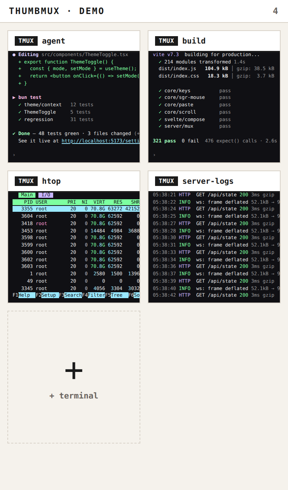
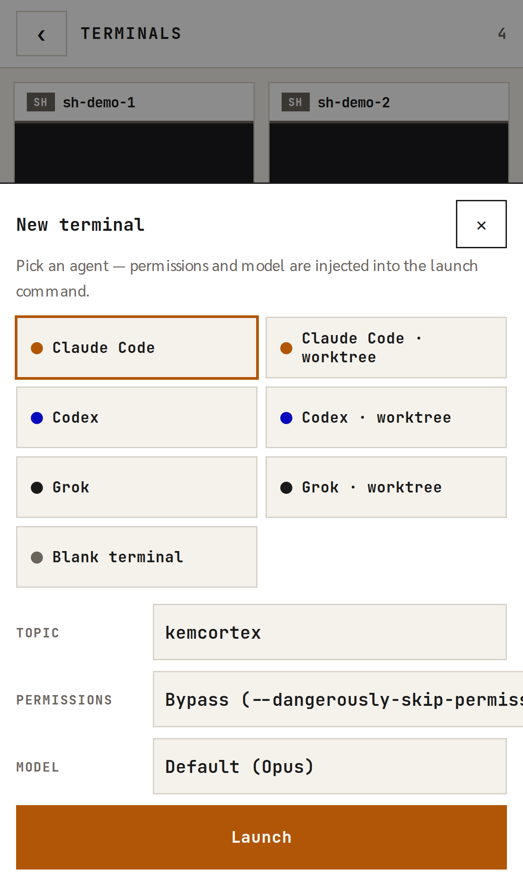
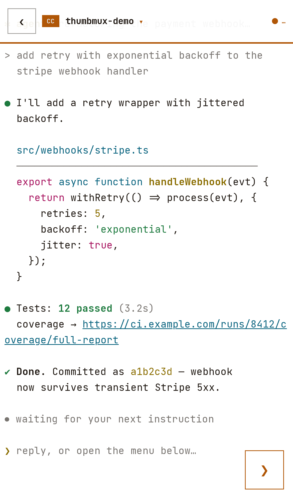
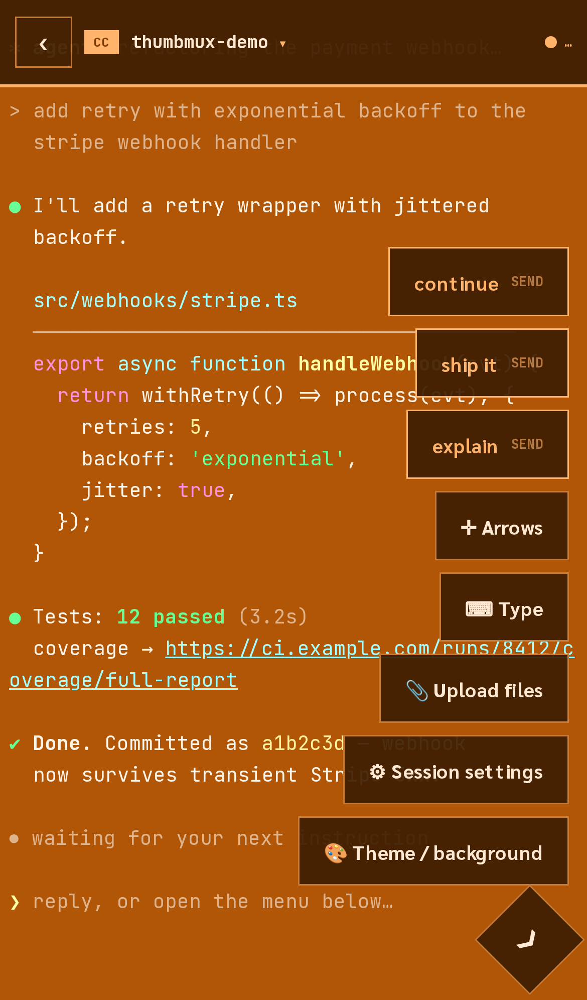
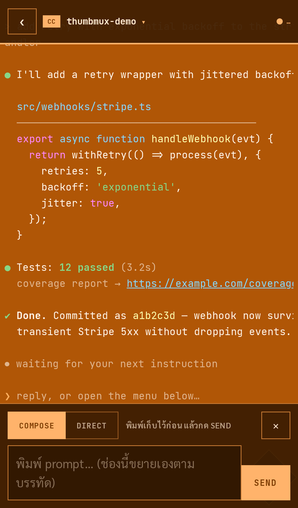
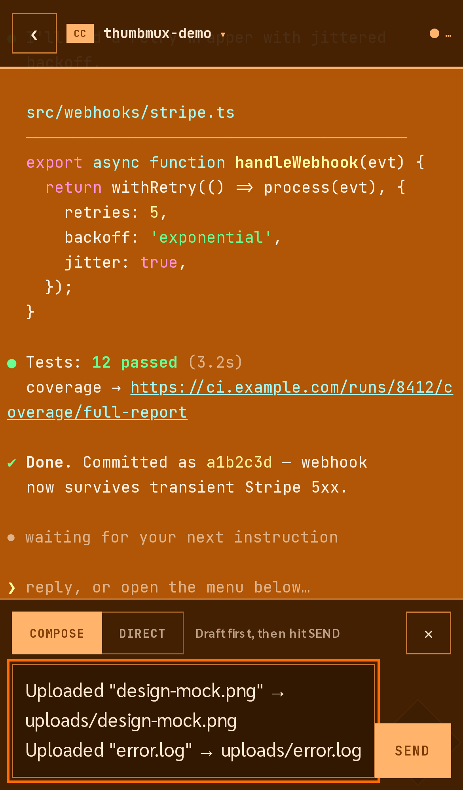
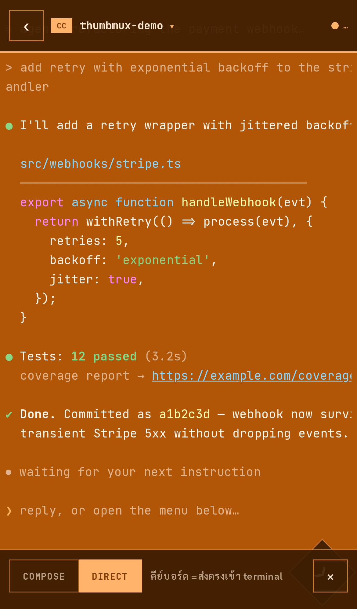
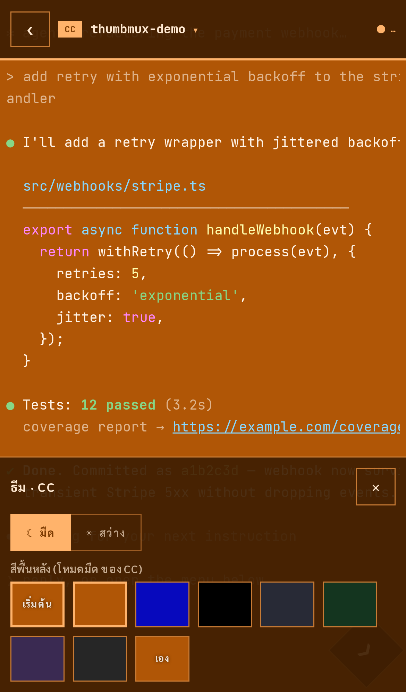
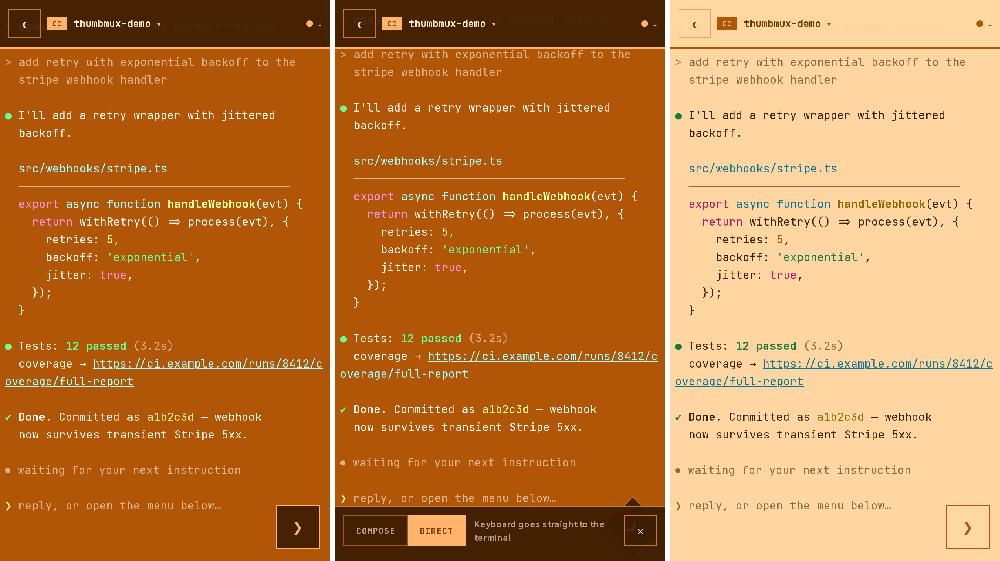

# thumbmux

**tmux for thumbs.** A mobile-first web terminal stack for driving tmux
sessions — especially AI coding agents — from your phone.

   

> **Status:** 0.x, source-first, extracted from a production system where it
> drives real Claude Code / Codex / Grok sessions daily. **Not on npm yet**,
> but the demo runs in two minutes: `bun run demo` → scan the QR
> ([jump to Getting started](#getting-started)).

Born from a real itch: [Claude Code], Codex CLI and Grok CLI running in tmux on
a server, and a human on a phone who still has to steer them. Every web
terminal we tried treats the phone as a tiny desktop — pinch, squint, mis-tap,
rage. thumbmux treats the phone as the primary device: one-thumb controls,
native scroll physics, and a keyboard that never fights the layout.

## A hub of every terminal you're running

<p align="center"></p>

This is the front door: a grid of **live miniatures** — every card is the
actual pane streaming in real time. Four agents crunching in parallel reads at
a glance; tap a card to drop in, or tap **+ terminal** to launch another.

Miniatures are cheap by design: each one subscribes in **tail mode**, so the
server slices the stream to the last ~40 pane lines for that socket. Measured
on the production box: a full snapshot frame is 19–136 KB; a thumbnail frame
is ~5 KB — and captures are shared server-side with any full viewer of the
same session, so a ten-card hub adds no extra tmux work.

## Launch presets that speak agent

<p align="center"></p>

The **+ terminal** card opens a launcher with the stock seven: Claude Code,
Codex and Grok — each plain or in an **isolated git worktree** — plus a blank
shell. Every agent preset injects its own permission-bypass flag by default
(`--dangerously-skip-permissions`, `--dangerously-bypass-approvals-and-sandbox`,
`--permission-mode bypassPermissions`), with dropdowns for **permission mode
and model** that go straight into the launch command. Generic hosts get a live
command preview; hosts that build the command server-side (like the one in
this shot) hide it and forward the choices to their spawn API. Presets are
data (`DEFAULT_LAUNCH_PRESETS`) — bring your own.

## The rest of the tour

### Scrolls like an app, not a canvas

<p align="center"></p>

The viewer never runs a terminal emulator in the scroll path. Captured pane
lines render into a virtualized DOM window, and a flick is a `translate3d`
update — no reparse, no repaint of terminal cells — so scrolling runs at
whatever refresh rate your display has. You get **real text selection** (it's
real DOM), momentum and rubber-band physics tuned to feel like iOS — and older
scrollback streams in as you pull down — unlimited when the host wires a history archive; the bare demo serves tmux's live window (~2,000 lines).

**URLs are tappable** — including URLs that wrap across lines mid-output.
In the shot above, the coverage link spans two pane lines; both fragments are
live, underlined, and open the same URL. Links are reconstructed at the
current pane width, so this survives resizes too.

### Everything behind one thumb

<p align="center"></p>

A single ❯ launcher fans out the whole control surface: **one-tap preset
sends** (`continue` / `ship it` / `explain` — configurable), an **arrow pad**
for TUI menus, typing, file upload, theming — and whatever your host app adds.

The `Session settings` entry in this shot isn't part of thumbmux: the host
application injected it (agent roles, team links, auto-continue — from the
system this stack was extracted from). Actions and sheets are plugin points,
not hardcoded chrome.

### A composer that never covers the terminal

<p align="center"></p>

Opening the input sheet doesn't overlay the pane — the terminal viewport
**docks above it**, so the agent's last lines stay visible while you type.
When the OS keyboard rises, everything rides on top of that too
(VisualViewport-tracked).

The part you can't see: none of this ever resizes the underlying tmux pane.
Insets are computed against each host element's closed-state baseline so the
math cancels exactly — other viewers of the same session never see a reflow.

### Shortcut chips + a manager to edit them

One-tap prompt chips above the composer ("continue", "run it", or your own in any
language) — add, edit, reorder and delete them in a built-in ShortcutsSheet, persisted
through the same preferences adapter as everything else.

### Paste a picture, get it uploaded

Paste an image into the composer (COMPOSE or DIRECT) and it rides the same upload
pipeline as the attach button: stored with a sanitized name, composer prefilled with
the paths, ready to send.

### Session notes + recent prompts, one tap away

Tap the session title: a panel drops with the session's note (edit in place; hosts can
add actions like "distill with an LLM") and the last prompts extracted from the pane —
tap one to prefill the composer for edit/resend.

### Copy the screen like a text file

One action copies the visible buffer — ANSI stripped, grid padding trimmed — via the
clipboard API, with a fallback for plain-http LAN hosts.

### Preferences that follow you

Theme, font size, shortcuts and notes live behind a tiny PreferencesAdapter: localStorage
for the demo, or a server-backed JSON file (`createPrefsHandler`) so your phone and
laptop stay in sync.

### Attach files from your phone

<p align="center"></p>

Pick photos, logs, anything — they upload into the session's workspace, and
the composer is **prefilled with the stored paths** (`Uploaded
"design-mock.png" → uploads/design-mock.png`), so one SEND hands them straight
to the agent.

This ships turnkey: `UploadAction` (client — hidden picker, upload, prefill
message) plus `createUploadHandler` (server — a fetch-style endpoint that
stores files with sanitized, collision-proof names). The demo wires them in
two lines each; agents like Claude Code can then open the uploaded image
straight from the path you send. Hosts with their own storage (like the
system in this shot) can still swap in a custom endpoint.

### DIRECT mode: the keyboard *is* the terminal

<p align="center"></p>

Switch to DIRECT and the visible input box disappears — an invisible ghost
input holds focus, the OS keyboard rises, and **every keystroke streams
straight into tmux**: text (IME-composed scripts like Thai included) via input
events, Enter/Esc/Tab/arrows via keydown. It feels like typing *in* the
terminal, because effectively you are.

### Re-theme the whole surface from one color

<p align="center"></p>

Pick a swatch — or any hex. Text color, HUD chrome, borders and accent are all
derived from the background's luminance, and the ANSI text palette swaps to
contrast-picked variants for light vs dark backgrounds. No unreadable
terminals, whatever color you land on.

<p align="center"></p>
<p align="center"><sub>the same session on white (the default), black, blue and orange — one luminance formula, ANSI palette included</sub></p>

## Under the hood

No terminal emulator in the browser's hot path, no polling storms, no
per-frame parsing. The pipeline:

```
tmux pane ──pipe-pane──▶ dirty signal ──debounce 15ms (100ms max)──▶ capture-pane
                                                                        │
        fallback: adaptive poll (4 FPS idle → 10 FPS for 5s after keys) │
                                                                        ▼
                        content hash changed? ──no──▶ drop (nothing sent)
                                │ yes
                                ▼
                 one WebSocket, many sessions ──▶ full viewers: full window
                                              └─▶ thumbnails: last ~40 lines
                                                                        │
                                                                        ▼
                    SGR→HTML incremental renderer (carried state per line)
                                │
                                ▼
      virtualized DOM window · scroll = translate3d at the display's Hz
```

**Refresh behavior, concretely:**

| stage | rate / size |
|---|---|
| output detection | `pipe-pane` dirty signals, debounced 15 ms (100 ms max wait); polling fallback at 4 FPS idle, 10 FPS for 5 s after a keystroke |
| change dedupe | content hash per capture — an unchanged pane sends **zero bytes** |
| full viewer frame | the live scrollback window (measured 19–136 KB on real agent sessions) |
| thumbnail frame | tail mode, last ~40 lines (~5 KB measured — ~4–28× smaller) |
| keystroke frame | ~60 bytes (`{type, session, data}` — no metadata blob on the hot path) |
| scroll rendering | compositor transform only; DOM patches happen outside the gesture, at window edges |
| keepalive | client ping every 25 s (under carrier NAT timeouts), reconnect with backoff, visibility-aware |

**Technology:** TypeScript end-to-end. `core/` is zero-dependency (SGR state
machine, wrapped-URL reconstruction, prompt scanning, luminance math, the WS
protocol types). `svelte/` is Svelte 5 (runes) — the only runtime dependency
of the UI. `server/` runs on Bun or Node against plain `tmux capture-pane` /
`pipe-pane` / `send-keys`, with every host-specific decision (drivers, resize
arbitration, telemetry, session profiles) injected. No xterm.js anywhere in
the mobile path.

## Getting started

Pick your lane. (Reminder: source-first — not on npm yet.)

**⚡ Try it in two minutes (the demo).** On any machine with `tmux` and
[Bun](https://bun.sh):

```bash
git clone https://github.com/kemkem23/thumbmux
cd thumbmux && bun install
bun run demo            # binds 127.0.0.1
bun run demo -- --host  # expose on your LAN for the phone
```

It prints a QR code — scan it with your phone and you're looking at your own
tmux sessions in the hub. The URL carries a random token (cookie'd on first
visit): **anyone with that URL can type into your tmux**, so treat it like an
SSH key. The demo is one Bun process: the built UI, the WebSocket mux, and a
reference `TmuxDriver` against your local tmux.

**🤖 The agent way.** Paste this into Claude Code / Codex in your
project:

> Clone https://github.com/kemkem23/thumbmux into `vendor/thumbmux`, read its
> README and the `core/`, `svelte/`, `server/` packages, then wire it into
> this app: alias `@thumbmux/*` to the package `src/` dirs, mount `TmuxWsMux`
> on a `/ws/tmux` WebSocket route with a driver for my tmux, and add a page
> using `SessionGrid` + `LaunchSheet` + `TermView` + `ComposerDock`. Show me
> the wiring plan before writing code.

**🔒 The security-conscious way.** Same as above, but audit first — paste
this before installing:

> Read every file in https://github.com/kemkem23/thumbmux (core/, svelte/,
> server/ — it's small). Flag anything that phones home, executes remote
> content, touches files outside its packages, or handles keystrokes/session
> content in a way I should not trust. Summarize what data flows where, then
> wait for my go-ahead.

(It's ~4k lines of TypeScript with zero runtime dependencies in `core/` —
an agent reads it in one sitting. That's a deliberate design goal.)

**🛠 The manual way.** Clone, then wire the two ends yourself:

1. Alias the packages (tsconfig `paths` / Vite alias): `@thumbmux/core`,
   `@thumbmux/svelte`, `@thumbmux/server` → each package's `src/`.
2. Server: instantiate `TmuxWsMux` with your `TmuxDriver` (capture/keys/
   resize/activity against your tmux) and route WS messages to
   `mux.handleMessage` — snippet below.
3. Client: `SessionGrid` for the hub, `TermView` + `ComposerDock` for the
   terminal page — snippet below.

## What's inside

```
thumbmux/
├── core/    framework-free TypeScript, zero dependencies
├── svelte/  Svelte 5 components (everything in the tour)
├── server/  Bun/Node WebSocket mux engine for tmux
└── demo/    one-command demo (Bun server + reference driver + QR)
```

| package | what you get |
|---|---|
| **`@thumbmux/core`** | `ansi-html` incremental SGR→HTML renderer · `terminal-link` wrapped-URL detection · `terminal-scroll` jump-free capture merging · `prompt-scan` extraction of *submitted* prompts from raw pane text (the composer's ghost/placeholder text is filtered by its SGR-2 faint styling) · `surface` one-color→full-surface derivation · `launch` launch presets + pure command builder · `protocol` the WS message types |
| **`@thumbmux/svelte`** | `TermView` the compositor-scroll viewer · `ComposerDock` COMPOSE/DIRECT input sheet with dock/keyboard insets · `SessionGrid` + `SessionThumb` live-miniature hub · `LaunchSheet` preset launcher (permission/model dropdowns) · `UploadAction` attach-files picker · `TermHud` pinned status bar with a host panel slot · `ActionFab` launcher + action slots · `DpadSheet`, `ThemeSheet`, `NewTerminalSheet` · `ws-mux` reconnecting multiplexed WS client |
| **`@thumbmux/server`** | `TmuxWsMux` — one process serves every viewer: shared adaptive polling, `pipe-pane` dirty signals, content-hash dedupe, per-socket tail mode, scrollback history expansion, session-list pushes. Everything host-specific is injected — and `createBunTmuxDriver()` is a complete reference implementation, with `createUploadHandler()` for turnkey file attachments. |

### What the server wiring looks like

```ts
import { TmuxWsMux } from '@thumbmux/server';

const mux = new TmuxWsMux({
  driver,                     // how to talk to tmux: capture/keys/resize/activity
                              // (bring your own today — a reference driver ships
                              //  with the upcoming demo)
  pipes,                      // optional: pipe-pane manager for instant dirty signals
  archive,                    // optional: scrollback archive for history expansion
  profile: (session) => ({    // per-session behavior
    resize: true,             //   browser-authoritative geometry?
    currentPaneOnly: false,   //   alt-screen TUI (capture screen, not scrollback)?
    archive: true,
  }),
  hooks: {                    // your policy layer
    onResizeRequest: (session, ws, geo, client) => ({ apply: true }),
  },
});

// in your WS handler — handleMessage also answers client keepalive pings:
ws.onmessage = (e) => mux.handleMessage(JSON.parse(e.data), ws);
ws.onclose  = () => mux.unsubscribeAll(ws);
```

### What the client wiring looks like

```svelte
<script>
  import { TermView, ComposerDock, tmuxMux } from '@thumbmux/svelte';
  const palette = {  // ANSI 0-15 + defaults — or derive one via @thumbmux/core
    base: ['#000','#f66','#6f6','#ff6','#66f','#f6f','#6ff','#eee',
           '#888','#f88','#8f8','#ff8','#88f','#f8f','#8ff','#fff'],
    defaultFg: '#e6e6e6', defaultBg: '#101014',
  };
  let composer = $state();  // openDock() must run inside the tap's call stack
  let dockFull = $state(0), kbInset = $state(0);
</script>

<!-- this viewport's closed-state bottom is 0, so it docks by the FULL sheet
     height (dockFull); hosts whose baseline is env(safe-area-inset-bottom)
     use dockInset instead — see ComposerDock's header comment -->
<div class="viewport" style:bottom={`${dockFull + kbInset}px`}>
  <TermView session="my-session" {palette} bottomInsetPx={dockFull + kbInset} />
</div>

<button class="type" onclick={() => composer?.openDock()}>⌨</button>

<ComposerDock
  bind:this={composer}
  bind:dockFull bind:kbInset
  onSend={(text) => tmuxMux.sendKeys('my-session', text + '\r')}
  onDirectText={(d) => tmuxMux.sendKeys('my-session', d)}
  onDirectKey={(seq) => tmuxMux.sendKeys('my-session', seq)}
/>

<style>
  .viewport { position: absolute; top: 0; left: 0; right: 0; }
  .type { position: absolute; right: 12px; bottom: 12px; }
</style>
```

## iOS scar tissue

The lessons are encoded in the components so you don't have to relearn them:

- iOS raises the keyboard **only** for `focus()` calls made synchronously inside
  the tap's call stack. A `setTimeout` focus silently sets `activeElement` with
  the keyboard down. (That's why `ComposerDock.openDock()` exists.)
- Safari will not scroll-to-reveal an invisible focused input — track
  `visualViewport` yourself, subtract `offsetTop`, and guard against pinch-zoom.
- An `opacity: 0` input is focusable; `display: none` is not. Keep it at
  `font-size: 16px`, or Safari zooms the page.
- Never resize the pty because a transient overlay appeared. Compute insets
  against each host element's closed-state baseline so the add-back cancels
  exactly and the pane geometry never flaps.
- The iOS keyboard is translucent — anything parked behind it shows through.

## Roadmap

- [x] Session hub: live-miniature grid + the seven launch presets
- [x] Tail-mode subscriptions (thumbnails at ~5 KB/frame instead of the full window)
- [x] Runnable demo app + reference `TmuxDriver` (clone → `bun run demo` → scan QR)
- [ ] npm packages (`@thumbmux/core` / `svelte` / `server`)
- [ ] Scroll-feel GIF captured from a real device
- [x] Protocol doc ([docs/protocol.md](docs/protocol.md)) + conformance suite (`server/tests/`)

The screenshots above are the production UI this stack was extracted from,
talking to a live tmux session — running a scripted demo transcript, so no
real project content leaks into the docs.

## License

MIT © [kemkem23](https://github.com/kemkem23)

[Claude Code]: https://claude.com/claude-code
