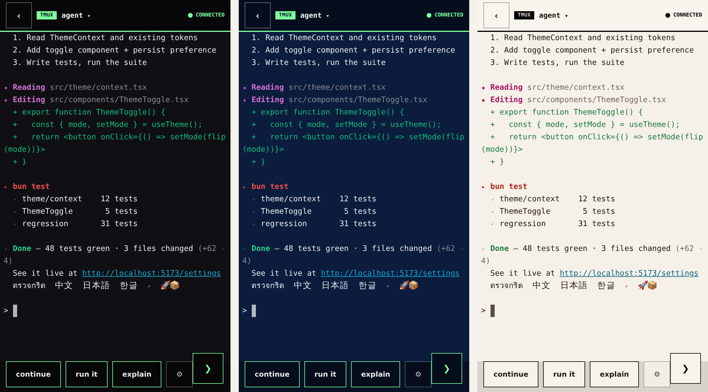
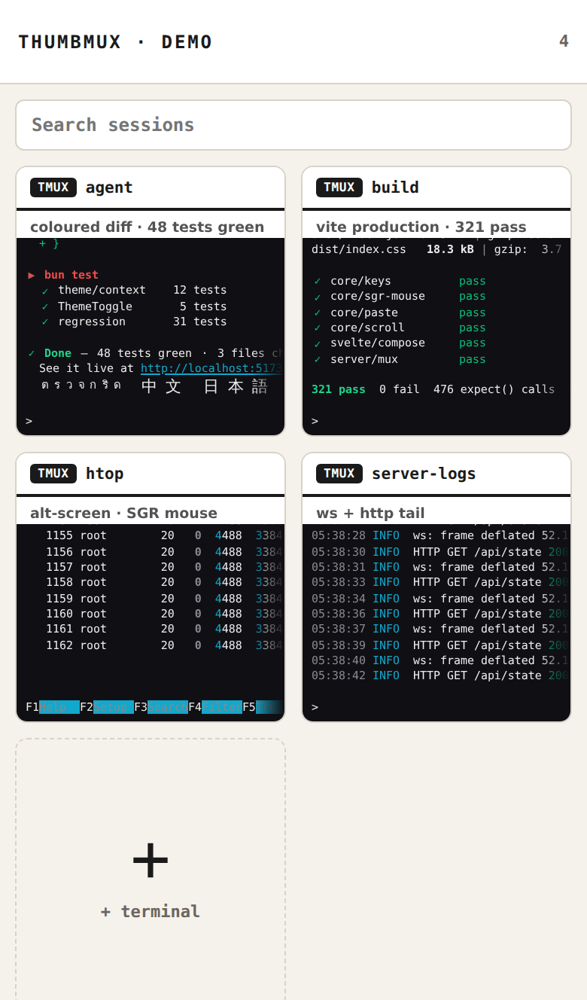
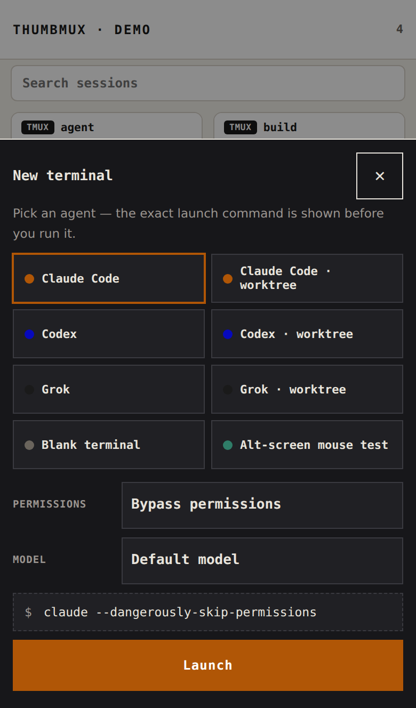
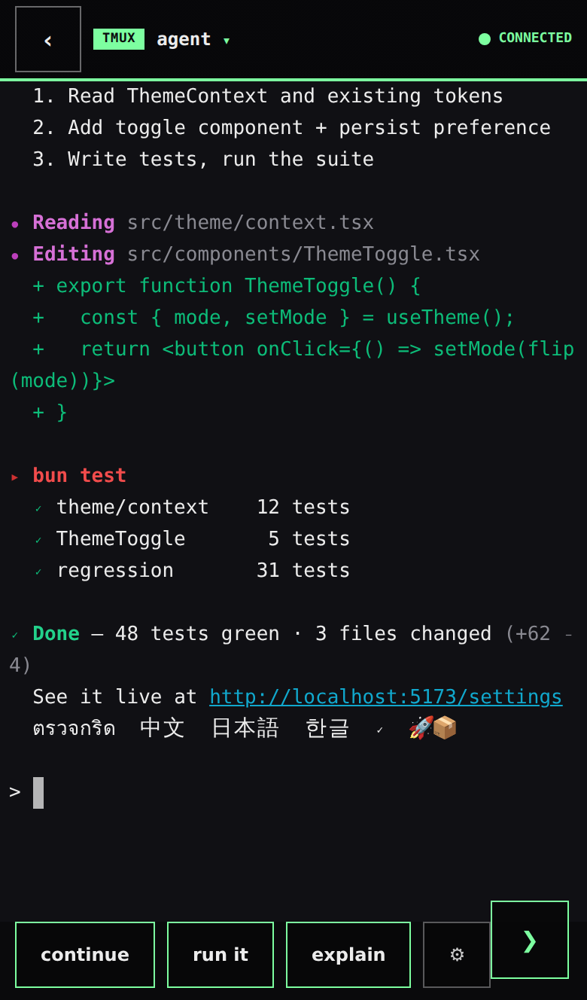
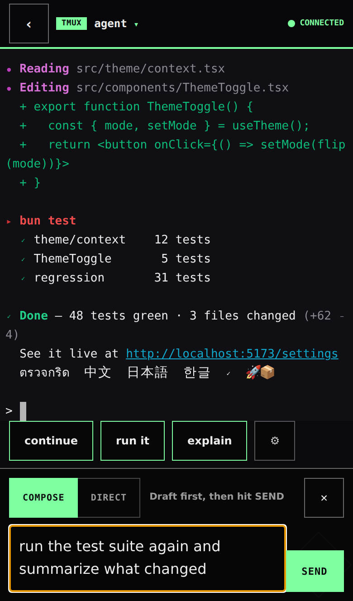
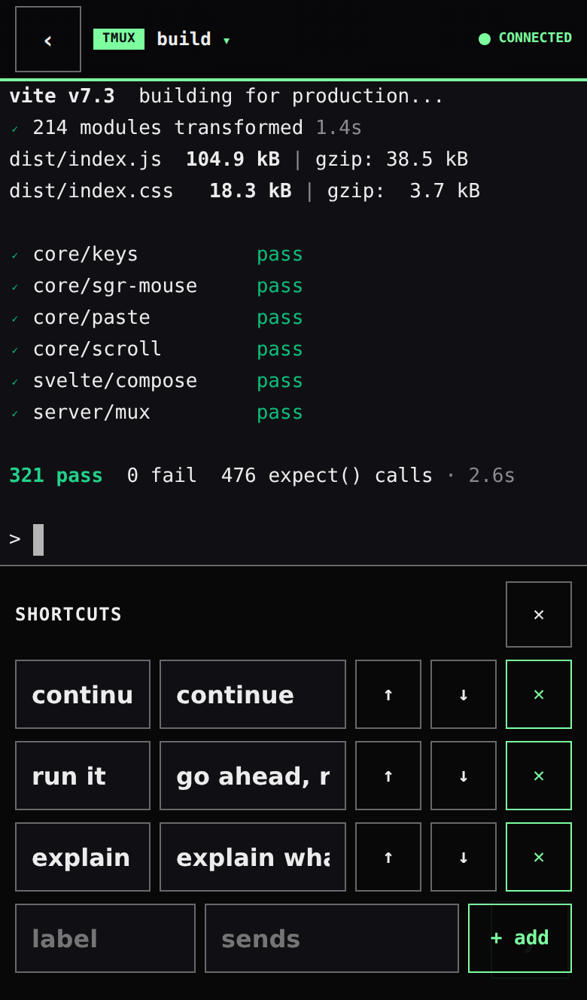
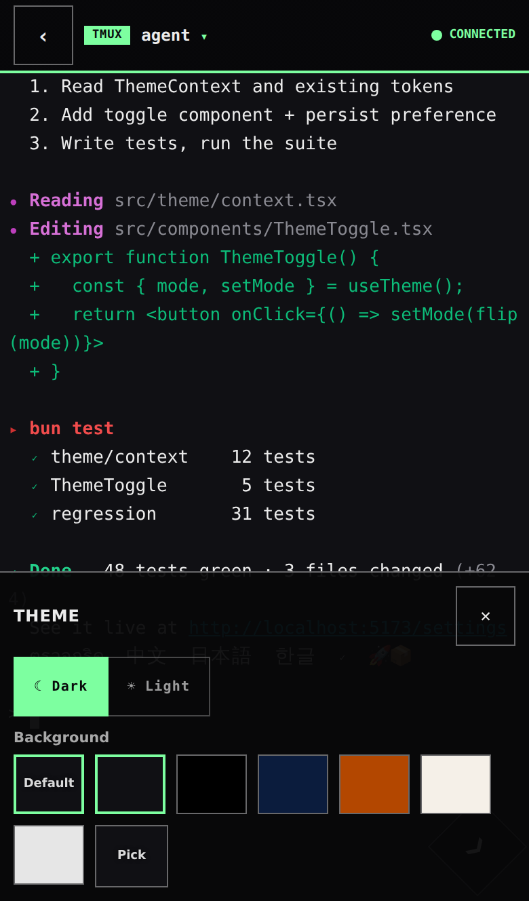
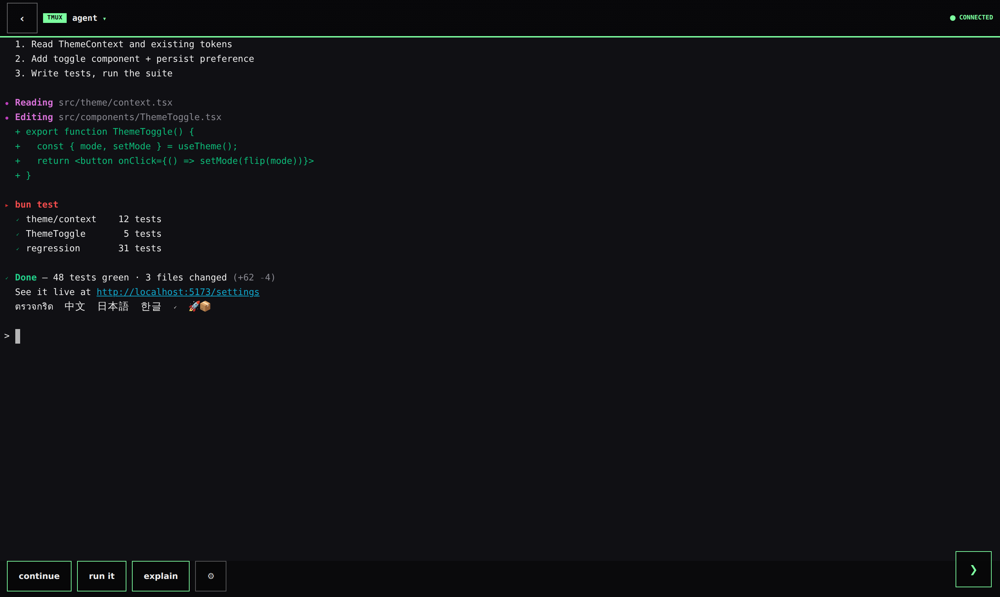
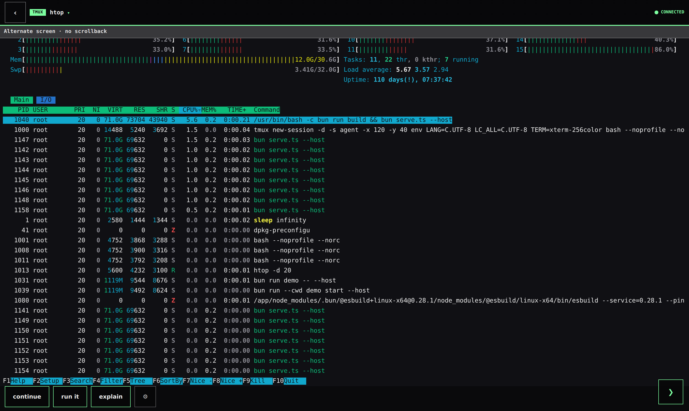

<div align="center">

# thumbmux

**tmux for thumbs — and now for desks.**

A batteries-included web terminal stack for driving tmux sessions — especially
AI coding agents — from any screen: a compositor-scroll viewer that runs at
your display's refresh rate, a keyboard-aware composer, a live session hub,
and a multiplexed WebSocket engine. Three small packages you can wire into
any app in an afternoon.

[](https://github.com/kemkem23/thumbmux/actions/workflows/ci.yml)
[](https://github.com/kemkem23/thumbmux/tags)
[](LICENSE)




<sub>Every screenshot in this README is the bundled demo running scripted
transcripts in a clean container — reproduce them yourself with `bun run demo`.</sub>

</div>

---

## Why thumbmux

Born from a real itch: agent TUIs running in tmux on a server, and a human on
a phone who still has to steer them. Every web terminal we tried treats the
phone as a tiny desktop — pinch, squint, mis-tap, rage. thumbmux treats the
phone as the primary device, and rebuilds the viewer around one idea:
**during a gesture, the compositor should be the only thing working.**

- **Scrolls at your display's refresh rate.** ANSI is parsed *off* the gesture
  path into cached HTML; the scroll itself is `translate3d` over a virtualized
  window of rows. While your finger is down, nothing parses, nothing reflows,
  nothing repaints terminal cells — 60 Hz screens get 60, 120 Hz screens
  get 120. Momentum, rubber-band and bottom-anchoring are re-implemented
  px-true to iOS.
- **Real DOM, real text.** Select it, copy it, tap URLs — even ones that wrap
  across three lines. It's a document, not a picture of one.
- **Input that respects the OS.** A composer dock that never covers the
  terminal (and never resizes the pty), a DIRECT mode where the phone keyboard
  *is* the terminal, and a desktop wrapper with xterm-parity key encoding —
  AltGr, macOS Option, IME composition and all.
- **One engine, every viewer.** The server polls each tmux session once no
  matter how many browsers watch it — content-hash dedupe, cursor-only frames,
  tail-mode thumbnails, opt-in line-delta frames, and opt-in per-message
  deflate for cellular-friendly traffic.

## The tour

### A hub of everything you're running

Live miniatures — every card is the actual pane streaming in real time, so
four agents crunching in parallel reads at a glance. Thumbnails subscribe in
**tail mode**: ~5 KB per frame instead of the 19–136 KB full snapshot, and
captures are shared server-side with any full viewer of the same session, so
a ten-card hub adds no extra tmux work. Tap **+ terminal** for launch presets
with permission and model dropdowns and **isolated git-worktree** options —
presets are data, bring your own.

<p align="center">
  
  
</p>

### A terminal that reads like an app

Syntax colors survive the trip (incremental SGR→HTML with cross-line state),
URLs are tappable `<a>` elements even when they wrap, and the caret sits
exactly where tmux says it does — Thai/CJK/emoji width-aware. Pull down and
older scrollback streams in (unlimited when the host wires a history archive).
When the pane width changes, the live window reflows from tmux and arrives as
a full reset; archived rows deliberately keep their original physical wrapping
so history never gets silently rewritten ([details](docs/reflow.md)).

<p align="center">
  
  
</p>

The composer **docks, never covers**: the viewport shrinks by exactly the
sheet height and springs back — the pty is never resized by a transient
overlay, so an agent's TUI layout never flaps. Prefer raw? **DIRECT mode**
holds focus in an invisible input so the OS keyboard drives the pane
keystroke-by-keystroke, Thai IME included.

### One-tap shortcuts, notes, uploads

A shortcut bar above the dock (tap = send, per-agent filtering) with a manager
sheet to add/edit/reorder — persisted through a `PreferencesAdapter` that can
live in `localStorage` or sync through your server so every device shares one
set. Session notes and recent prompts sit one tap away in the HUD panel
(`NotePanel` / `PromptsPanel`), and `UploadAction` turns attach-or-paste-a-
picture into an uploaded path prefilled in the composer.

<p align="center">
  
  
</p>

Theming is one color: hand `defaultSurface()` any background hex and it derives
foreground, HUD chrome, and a readable 16-color ANSI palette from luminance —
the whole surface re-skins instantly. Use `deriveSurface(bg, base)` when you
want to preserve your own branded surface defaults.

### Desktop is first-class now

`DesktopKeys` wraps any `TermView`: click to focus (thin `:focus-visible`
ring), then just type. Keys route through an **xterm-parity encoder** —
modified F-keys, Ctrl+digit control bytes, AltGr third-level shift, macOS
Option via `altIsMeta`, IME composition guards — pinned by 155 unit tests.
Ctrl+C copies when you have a selection and interrupts when you don't. Paste
is bracketed, with size-warning thresholds and a confirm hook.

<p align="center"></p>

Full-screen TUIs that keep output in their own buffer? Set `altScreenMouse`
and TermView forwards wheel, click **and touch drags** as SGR mouse
sequences — with fractional-line accumulation so a precision trackpad doesn't
send your pager flying, and a composer-row clamp so events land where the TUI
actually listens.

<p align="center"></p>

The complete interaction contract — focus model, key routing, copy/paste
policy, geometry ownership, view-only surfaces — is specified in
[docs/desktop.md](docs/desktop.md).

## The numbers

| | |
|---|---|
| **Gesture path** | 0 parses, 0 reflows — `translate3d` over a ±60-row virtualized window; ANSI→HTML is incremental and cached off-gesture |
| **Idle session, on the wire** | ~0 — adaptive polling backed by `pipe-pane` dirty signals + content-hash dedupe; unchanged panes send nothing |
| **Busy session, on the wire** | cursor-only frames (~60 B) when just the caret moved; opt-in validated line deltas cut suffix-heavy traffic by 95% vs equivalent full frames in the clean-container e2e; per-message deflate remains available |
| **Thumbnails** | tail mode: ~5 KB/frame vs the 19–136 KB full snapshot; captures shared across all viewers of a session |
| **Keystrokes** | ~60 B hot-path frames — client metadata attaches once per connection, not per key |
| **Tests** | 730 source tests across 42 files (including 890k+ stress assertions) + 12 canonical clean-container e2e tests against real tmux panes |
| **Search overlay** | dense highlight path is linear — 10,000 unit matches on one row measured **482.75 ms → 7.44 ms** after the v0.4 fix |
| **Delta fan-out (v0.5)** | one changed line on a 2,000-row pane to 20 delta subscribers: **69.2 ms → 3.9 ms** at 160 KB (flat in viewer count — grouped serialize once, fan out) |
| **Client delta apply (v0.5)** | **14.49 ms → 0.094 ms** median (~150×); ~88× under the 8.33 ms 120 Hz frame budget |
| **Core weight** | `thumbmux/core` ≈ 4 k lines of TypeScript, **zero runtime dependencies** — you (or your agent) can audit it in one sitting |

## Get started

**📦 In your app — plug and play.** Every release ships an immutable
`vX.Y.Z-dist` tag with prebuilt `dist/` for all three packages: plain install
with **bun, npm, pnpm or yarn** — no build step, no lifecycle scripts.

```bash
bun add  thumbmux@github:kemkem23/thumbmux#v0.5.0-dist
# or
npm i    github:kemkem23/thumbmux#v0.5.0-dist
```

```ts
import {
  TmuxWsMux,
  createBunTmuxDriver,
  createSpawnHandler,
  createUploadHandler,
  createPrefsHandler,
  FrameJournal,
  createTokenGuard,
} from 'thumbmux/server';
import {
  defaultSurface,
  buildLaunchCommand,
  submitPlan,
  searchLines,
  parseReplayJournal,
  normalizeAgentNotificationEvent,
} from 'thumbmux/core';
```

```svelte
<script>
  import {
    TermView,
    DesktopKeys,
    ComposerDock,
    SessionGrid,
    TermSearch,
    RecordingPlayer,
    NotificationPermission,
    tmuxMux,
  } from 'thumbmux/svelte';
</script>
```

`thumbmux/svelte` resolves via the `svelte` export condition — Vite/SvelteKit
pick it up automatically (it ships `.svelte` sources + `.d.ts`, compiled by
your bundler, which is how Svelte libraries work). **Pin `-dist` tags only** —
updating is bumping the tag and reinstalling.

**⚡ In two minutes — the demo.** On any machine with `tmux` and Bun:

```bash
git clone https://github.com/kemkem23/thumbmux
cd thumbmux && bun install
bun run demo            # binds loopback
bun run demo -- --host  # expose on your LAN for the phone
```

It prints a QR code — scan it and you're looking at your own tmux sessions.
The URL carries a random token (cookie'd on first visit): **anyone with that
URL can type into your tmux**, so treat it like an SSH key. The demo includes
an alt-screen preset so you can feel the SGR mouse forwarding immediately.
Scrollback storage is private and per-run by default. Setting
`THUMBMUX_HISTORY_ROOT` explicitly opts into persistence keyed by tmux session
name; reuse a name only for the same logical session.

**🤖 The agent way.** Paste into an agent TUI in your project:

> Install `thumbmux@github:kemkem23/thumbmux#v0.5.0-dist`, read its README,
> then wire it in: mount `TmuxWsMux` from `thumbmux/server` on a WebSocket
> route with a driver for my tmux, and add a page using `SessionGrid` +
> `LaunchSheet` + `TermView` + `DesktopKeys` + `ComposerDock` from
> `thumbmux/svelte`. Show me the wiring plan before writing code.

**🔒 The security-conscious way.** Same, but audit first:

> Read every file in the thumbmux package (core/, svelte/, server/ — it's
> small). Flag anything that phones home, executes remote content, touches
> files outside its packages, or handles keystrokes/session content in a way I
> should not trust. Summarize what data flows where, then wait for my
> go-ahead.

## Wiring

**Server** — one mux serves every viewer; everything host-specific is
injected (`createBunTmuxDriver()` is a complete reference implementation):

```ts
import { FileHistoryArchive, TmuxWsMux } from 'thumbmux/server';

const archive = new FileHistoryArchive({
  root: '.thumbmux-history', // omit for a private per-run temp directory
  maxLines: 20_000,
});

const mux = new TmuxWsMux({
  driver,                     // capture/keys/resize/activity against your tmux
  pipes,                      // optional: pipe-pane manager → instant dirty signals
  archive,                    // optional: scrollback archive → history expansion
  compressFrames: true,       // optional: Bun per-message deflate (pair with
                              //   perMessageDeflate: true on Bun.serve)
  profile: (session) => ({
    resize: true,             // browser-authoritative geometry?
    currentPaneOnly: false,   // alt-screen TUI (capture screen, not scrollback)?
    archive: true,
  }),
  hooks: {
    onResizeRequest: (session, ws, geo, client) => ({ apply: true }),
  },
});

// in your WS handler — handleMessage also answers keepalive pings and
// session-list subscriptions:
ws.onmessage = (e) => mux.handleMessage(JSON.parse(e.data), ws);
ws.onclose  = () => mux.unsubscribeAll(ws);
```

`PipeManagerLike` remains an extension interface, while `thumbmux/server` ships
`FileHistoryArchive` as its ready-to-use `HistoryArchiveLike` implementation.
Without `pipes`, live output still works through adaptive polling (250 ms
normally, 100 ms for five seconds after input) instead of instant `pipe-pane`
dirty signals. Without `archive`, live viewing still works, but history
expansion returns an empty page, so older archived scrollback is unavailable.

### Spawn endpoint (`createSpawnHandler`)

`LaunchSheet` does not choose an HTTP schema or make a request. Its
`onLaunch(spec, contextId)` callback receives the `LaunchSpec` built by
`buildLaunchSpec()`; a host can post that spec directly and map the separate
`contextId` to its own cwd/workspace policy:

```ts
import type { LaunchSpec } from 'thumbmux/core';

async function launch(spec: LaunchSpec, contextId: string | null) {
  const response = await fetch('/api/spawn', {
    method: 'POST',
    headers: { 'content-type': 'application/json' },
    body: JSON.stringify({
      ...spec,
      cwd: workspaceFor(contextId),
      // name: 'codex-project-1', // optional exact name
      // autoName: true,         // suffix an explicit collision instead of 409
    }),
  });
  const result = await response.json();
  if (!response.ok) throw new Error(result.error);
  return result as { ok: true; name: string };
}
```

The complete JSON contract is:

```ts
type SpawnPayload = {
  // LaunchSpec fields
  presetId?: string;  // known preset → server rebuilds command from selectors
  agent?: string;     // naming/host hint
  worktree?: boolean; // default false; true requires host prepare+cleanup hooks
  permission?: string;
  model?: string;
  command?: string;   // direct-command fallback when presetId is omitted

  // Host/session fields
  name?: string;      // omitted → collision-free generated name
  cwd?: string;       // omitted → configured handler cwd / process.cwd()
  autoName?: boolean; // explicit duplicate: false/omitted → 409; true → suffix
};
```

When `presetId` is present, it must exist in the handler's `presets` (the stock
presets are the default). The handler calls `buildLaunchCommand(preset,
permission, model)` and ignores submitted command text, so the server-side
preset is authoritative. Custom presets should be supplied to both
`LaunchSheet` and the handler. For the demo-compatible compact form, omit
`presetId` and post the already-built command:

```ts
body: JSON.stringify({ command: spec.command, worktree: spec.worktree })
```

Wire the fetch-style handler into any server route:

```ts
import { createBunTmuxDriver, createSpawnHandler } from 'thumbmux/server';

const driver = createBunTmuxDriver();
const handleSpawn = createSpawnHandler({
  driver,
  cwd: process.cwd(),
  namePrefix: 'term',
  validateCwd: (cwd) => cwd.startsWith('/srv/workspaces/')
    || 'cwd is outside the workspace root',
  // Opt-in only: the host creates the isolated checkout and returns its cwd.
  prepareWorktree: ({ name, cwd }) => createIsolatedCheckout({ name, cwd }),
  cleanupWorktree: ({ worktreeCwd }) => removeIsolatedCheckout(worktreeCwd),
});

if (url.pathname === '/api/spawn' && req.method === 'POST') {
  return handleSpawn(req);
}
```

A success is `201 { ok: true, name }`; an exact-name collision is `409`;
malformed payloads, invalid/non-directory cwd values, and worktree requests
without both hooks are `400`. `createSpawnHandler` never runs `git worktree` on its
own. Auto-named requests also retry if another tmux client wins the final
spawn race. For worktree requests, `cleanupWorktree` rolls back the checkout
after final-cwd validation or spawning fails, before a retry can use a new
name. If `prepareWorktree` itself throws before returning a path, that hook
owns any partial cleanup. A hook that needs a deliberate HTTP error can throw
`SpawnHandlerError`.

**This endpoint can execute caller-supplied shell commands in local tmux.**
Protect it with authentication (for example `createTokenGuard()` with an
interactive grant), restrict cwd with host policy, and never expose it as an
unauthenticated route.

### Wiring backpressure

Backpressure is enabled by default. Bun reports a full outbound queue by
returning `-1` from `ws.send()`; the mux then stops adding server-pushed frames
to that socket. Forward Bun's `drain` event so the mux can resume immediately
and send the peer its current state:

```ts
import type { MuxClientMessage } from 'thumbmux/core';

Bun.serve<{ ok: true }>({
  fetch(req, server) {
    return server.upgrade(req, { data: { ok: true } })
      ? undefined
      : new Response('upgrade failed', { status: 400 });
  },
  websocket: {
    open(ws) {
      mux.subscribeSessions(ws);
    },
    message(ws, raw) {
      try {
        mux.handleMessage(JSON.parse(String(raw)) as MuxClientMessage, ws);
      } catch {
        // Ignore malformed client frames.
      }
    },
    close(ws) {
      mux.unsubscribeAll(ws);
    },
    drain(ws) {
      mux.handleDrain(ws);
    },
  },
});
```

Without `drain`, there is no fast resume path. Auto-resume works only when the
WebSocket adapter can report its buffered amount (Bun sockets expose
`getBufferedAmount()`), and a socket whose queue has emptied still waits until
the next server broadcast before the mux observes that fact. An adapter that
cannot report buffered bytes requires an explicit `handleDrain` call to resume.

To keep the pre-v0.5.0 keep-sending behavior, use the escape hatch when you
construct the mux:

```ts
const mux = new TmuxWsMux({
  driver,
  backpressure: { enabled: false },
});
```

For backpressure that stays enabled, `maxBlockedMs` (default 30 seconds) and
`maxBufferedBytes` (default 8 MiB, when buffered-byte reporting is available)
are the controls for shedding a chronically slow peer instead of retaining it
indefinitely.

**Client** — a terminal page in ~40 lines. `submitPlan()` separates pasted text
from Enter because agent TUIs can swallow an Enter sent in the same tick. Set
the host-owned `agent` from launch/session metadata (it is not auto-detected)
so the Codex-specific second Enter is included:

```svelte
<script lang="ts">
  import { TermView, DesktopKeys, ComposerDock, tmuxMux } from 'thumbmux/svelte';
  import { defaultSurface, submitPlan, type SubmitAgent } from 'thumbmux/core';

  const session = 'my-session';
  const agent: SubmitAgent = 'generic'; // host-owned: 'claude', 'codex', or 'grok'
  const surface = defaultSurface('#101014');   // one hex → full palette
  const sendKeys = (data: string) => tmuxMux.sendKeys(session, data);
  async function sendSubmission(text: string) {
    for (const step of submitPlan(text, { agent })) {
      if (step.delayBeforeMs > 0) {
        await new Promise<void>((resolve) => setTimeout(resolve, step.delayBeforeMs));
      }
      sendKeys(step.keys);
    }
  }
  let composer = $state<ReturnType<typeof ComposerDock> | null>(null);
  let dockFull = $state(0), kbInset = $state(0);
</script>

<div class="viewport" style:bottom={`${dockFull + kbInset}px`}>
  <DesktopKeys onKeys={sendKeys} ariaLabel="Terminal input">
    <TermView
      {session}
      palette={surface.palette}
      bottomInsetPx={dockFull + kbInset}
      claimGeometry={true}
      altScreenMouse={false}
      onKeys={sendKeys}
      onTap={() => composer?.openDock()}
    />
  </DesktopKeys>
</div>

<ComposerDock
  bind:this={composer}
  bind:dockFull bind:kbInset
  onSend={(text) => { void sendSubmission(text); }}
  onDirectText={sendKeys}
  onDirectKey={sendKeys}
/>

<style>
  .viewport { position: absolute; top: 0; left: 0; right: 0; }
</style>
```

## What's inside

```
thumbmux/
├── core/    framework-free TypeScript, zero runtime dependencies
├── svelte/  Svelte 5 components (everything in the tour)
├── server/  Bun/Node WebSocket mux engine for tmux
└── demo/    one-command demo (Bun server + reference driver + QR)
```

| package | what you get |
|---|---|
| **`thumbmux/core`** | `ansi-html` incremental SGR→HTML renderer (modern underlines + OSC 8 hyperlinks + search overlay ranges) · `search` bounded visible-text / regex-lite scrollback search · `replay` strict full/delta journal parse + seek · `notification` host-supplied agent-notification contract · `terminal-link` wrapped-URL detection · `terminal-scroll` jump-free capture merging · `prompt-scan` submitted-prompt extraction · `keyboardEventToSequence` xterm-parity key encoding · `bracketedPaste` + `pasteInfo` thresholds · `submitPlan` (encodes the paste-ingest/Enter race agent TUIs have) · SGR mouse math for alt-screen TUIs · `surface` one-color theming · `launch` preset command builder · `protocol` the WS message types |
| **`thumbmux/svelte`** | `TermView` compositor-scroll viewer (`claimGeometry`, `altScreenMouse`, built-in search overlay) · `TermSearch` · `RecordingPlayer` · `NotificationPermission` · `DesktopKeys` desktop focus/key/paste wrapper · `ComposerDock` COMPOSE/DIRECT input sheet · `SessionGrid` + `SessionThumb` live-miniature hub · `LaunchSheet` preset launcher · `ShortcutBar` + `ShortcutsSheet` · `NotePanel` + `PromptsPanel` · `UploadAction` · `TermHud`, `ActionFab`, `DpadSheet`, `ThemeSheet`, `NewTerminalSheet` · `ws-mux` reconnecting multiplexed client · notification / service-worker helpers |
| **`thumbmux/server`** | `TmuxWsMux` — shared adaptive polling, `pipe-pane` dirty signals, content-hash dedupe, per-socket tail + delta modes, cursor-only frames, history expansion, session-list pushes, opt-in frame compression · `FileHistoryArchive` bounded file-backed scrollback archive · `FrameJournal` nonblocking NDJSON session recorder · `createTokenGuard()` scoped expiring bearer-token authorization · `createBunTmuxDriver()` reference driver · `createSpawnHandler()` + `createUploadHandler()` + `createPrefsHandler()` turnkey endpoints |

Docs: [session hub integration](docs/hub.md) ·
[desktop interaction contract](docs/desktop.md) ·
[WS protocol](docs/protocol.md) · [resize/reflow contract](docs/reflow.md) ·
[recording journal](docs/recording.md) · [notifications](docs/notifications.md) ·
[token guard](docs/security.md) · [release process](SPLIT.md)

<details>
<summary><b>iOS scar tissue</b> — lessons encoded in the components so you don't relearn them</summary>

- iOS raises the keyboard **only** for `focus()` calls made synchronously
  inside the tap's call stack. A `setTimeout` focus silently sets
  `activeElement` with the keyboard down. (That's why
  `ComposerDock.openDock()` exists.)
- Safari will not scroll-to-reveal an invisible focused input — track
  `visualViewport` yourself, subtract `offsetTop`, and guard against
  pinch-zoom.
- An `opacity: 0` input is focusable; `display: none` is not. Keep it at
  `font-size: 16px`, or Safari zooms the page.
- Never resize the pty because a transient overlay appeared. Compute insets
  against each host element's closed-state baseline so the add-back cancels
  exactly and the pane geometry never flaps.
- The iOS keyboard is translucent — anything parked behind it shows through.

</details>

## Roadmap

- [x] Session hub: live-miniature grid + launch presets, filters/search/grouping, state dots, keyboard nav (v0.3.3)
- [x] Tail-mode subscriptions (thumbnails at ~5 KB/frame)
- [x] Runnable demo + reference `TmuxDriver` (clone → `bun run demo` → scan QR)
- [x] Installable releases without npm: immutable `vX.Y.Z-dist` tags, prebuilt dists
- [x] Desktop: `DesktopKeys`, xterm-parity encoder, alt-screen SGR forwarding (wheel/click/touch)
- [x] Wire efficiency: cursor-only frames, tail mode, opt-in per-message deflate
- [x] Jank-free history expansion (state-convergent prepend, p95 16.7 ms) (v0.3.3)
- [x] Protocol doc ([docs/protocol.md](docs/protocol.md)) + conformance suite

**v0.3.4 / v0.3.5 — stability & wire perf**
- [x] Selection survives live output while scrolled up
- [x] Live-window reflow when the pane width changes
- [x] Validated opt-in line-delta frames with one-shot resync recovery
- [x] Demo hardening: scroll-to-bottom + new-content pill, selection-first copy, private file-backed history archive reference
- [x] Self-contained root git-dist (no unpublished `@thumbmux/core` workspace needed)

**v0.4.0 — capability wave (shipped)**
- [x] Search in scrollback (visible-text + regex-lite, highlight + jump in TermView)
- [x] OSC 8 hyperlinks + modern underline styles
- [x] Session recording & playback (`FrameJournal` + `parseReplayJournal` + `RecordingPlayer`)
- [x] Web-push / local notification scaffolding (core event contract + SW helpers + permission UI)
- [x] Token scopes (`createTokenGuard` — read/interactive, expiry, session allowlists)
- [x] PWA scaffolding (service-worker registration + notification click handlers)
- [x] Linear dense search-overlay rendering + real Svelte mount smoke tests

**v0.5.0 — performance & safety (shipped)**
- [x] Delta broadcast grouped by viewer identity — cost flat in viewer count
- [x] Client delta apply ~150× faster (incremental prefix hash + skip re-validate)
- [x] WebSocket backpressure on by default (`handleDrain` / auto-resume; legacy via `enabled: false`)
- [x] `filterSessionList` hook on every session-list delivery path
- [x] All-or-nothing multi-file uploads; quadratic wrapped-URL + capture-overlap fixes

**Later**: split view (two panes side by side), hub pinning + activity badges,
binary protocol (msgpack) / WebTransport, SSH-backed driver example,
collaborative viewing, docs site, npm packages, scroll-feel video from a real device

## License

MIT
